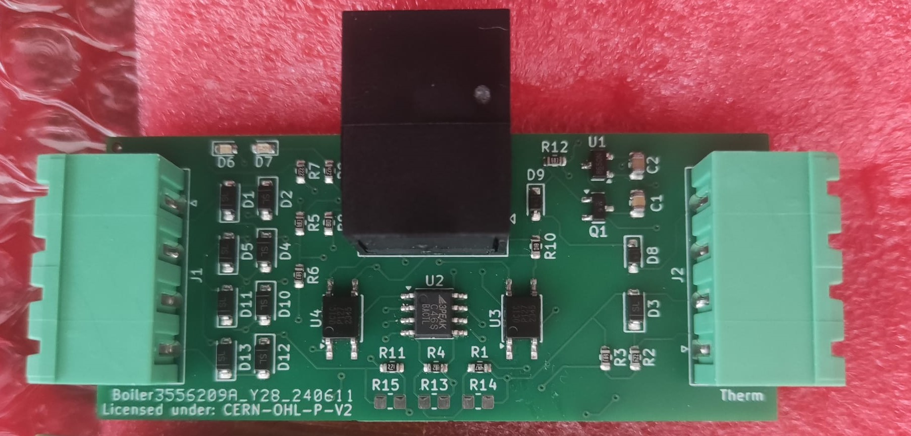

# NeedForHeat Boiler Monitor hardware

This repository contains the open hardware design files for the NeedForHeat Boiler Monitor hardware, which consists of PCB and 3D printable pipeclamps for:

* BASE module for the [M5Stack CoreInk device](https://shop.m5stack.com/collections/m5-controllers/products/m5stack-esp32-core-ink-development-kit1-54-elnk-display);
* 4-Terminal Thermostat Cable Splitter module, which is inserted by the subject in the signal path between boiler and thermostat;
* Two pipe clamps with temperature sensors that can be clipped on the supply and return pipes that carry hot water from the boiler to the radiators and returning from the radiators.

For the associated firmware, please see the [twomes-boiler-base-firmware](https://github.com/energietransitie/twomes-boiler-base-firmware) repository

This integrated device can:
* monitor OpenTherm signals between boiler and thermostat, similar to the [Twomes OpenTherm monitor](https://github.com/energietransitie/twomes-opentherm-monitor-hardware);
* monitor on/off signals between boiler and thermostat that do not adhere to the OpenTherm standard;
* monitor with supply and return water temperatures, similar to the [Twomes Temperature Monitor Hardware](https://github.com/energietransitie/twomes-temp-monitor-hardware).

## Table of contents
* [General info](#general-info)
* [Prerequisites](#prerequisites)
* [Producing](#producing)
* [Developing](#developing) 
* [Features](#features)
* [Status](#status)
* [License](#license)
* [Credits](#credits)

## General info
This repository contains the open hardware designs files and production files for the NFH Boiler Monitor. It also includes a `docs` folder with the recent Kicad files.

The splitter features a 4 wire terminal on each side in which the cables can be connected to in almost (see note) any orientation without the installer having to worry about the order. The LED's will light up if the splitter is working correctly.

Note: If the leds dont light up, switch the cables in wire terminal on the thermostat side. Either switch cable 1 and 2 or switch cable 3 and 4. 

For the associated firmware that you can run on this device, please see [Twomes boiler BASE firmware](https://github.com/energietransitie/twomes-boiler-base-firmware).

## Producing

### Printed Circuit Board
To fabricate the printed circuit board you can use various PCB services. 

The folder [pcb production](./pcb_production) includes all exported files needed to have the PCBs manufactured by [JLCPCB](https://www.jlcpcb.com). Upload the [zipped gerber file](./pcb_production/Gerber) to the [JLCPCB quote page](https://cart.jlcpcb.com/quote), select the amount of PCBs and a colour for the silkscreen. All other options can be left on default. If SMT assembly is desired, also select this option before ordering. This will take you to a page where the BOM and CPL files can be uploaded. Use the files in [BOM-CPL](./pcb_production/BOM-CPL).

### 3D Designs
To fabricate the pipe clamps you can use your own 3D printer or use a 3D printing service. 

The folder [3D_designs/Production](./3D_designs/Production) contains exported STL files for the [clamp](./3D_designs/Production/Pipeclamp.stl) and [lock](./3D_designs/Production/Pipeclamp_lock.stl) of pipeclamps. The STL files can be imported into any slicer and turned into G-Code for a 3D printer.

## Developing
### Printed Circuit Board
To change the hardware design of the PCB, you need:
* [KiCad](https://www.kicad.org/download/) installed to change te PCB design. 

The KiCad source files of the PCB can be found in the zip folder located in [docs](./docs).

To convert the PCBs into a format suitable for fabrication, consult the webpage of your PCB manufacturer of choice. For example, see the [JLCPCB guide on how to export Gerbers](https://support.jlcpcb.com/article/149-how-to-generate-gerber-and-drill-files-in-kicad) and the  [JLCPCB guide how to export the BOM and POS files](https://support.jlcpcb.com/article/84-how-to-generate-the-bom-and-centroid-file-from-kicad). You may also use a KiCad plug-in for this purpose such as [kicad-jlcpcb-tools](https://github.com/Bouni/kicad-jlcpcb-tools).

### 3D Designs
To change the hardware design of the enclosure, you need either:
* [Autodesk Fusion 360]([https://www.kicad.org/download/](https://www.autodesk.com/products/fusion-360/personal)) installed (Autodesk provides 30 day free trials and [free one-year educational access](https://www.autodesk.com/education/edu-software/overview?sorting=featured&filters=individual) to its products and services for eligible students, teachers and research staff); 
* or [FreeCAD](https://www.freecadweb.org/), an open source alternative.

## Features
The  NeedForHeat Boiler Monitor features the follwoing main hardware components:
* 4 Wire Terminal Thermostat Cable Splitter PCB circuit to monitor OpenTherm communication, including LEDs and optocouplers.
* Pipeclamps PCB circuit and designs for measuring temperatures from the pipes beneath the boiler.
* 3D Designs for pipeclamps with a lock.

To-do:
* Redesign the thermostat side on the cable splitter so its 100% orientation independent.
* Redesign the cableclamps design by a mechanical engineer to ensure quality and durability.
* Design an enclosure for the Thermostat Cable splitter.
* add 868 MHz SMD transceiver chip on BoilerBASE PCB to enable monitoring of various wireless thermostat solutions.

## Status
Project is:  _finished_

## License
The hardware designs in this repository are available under the [CERN-OHL-P v2 license](./LICENSE), Copyright 2024 [Research group Energy Transition, Windesheim University of Applied Sciences](https://windesheim.nl/energietransitie)

## Credits
This hardware is a collaborative effort of:
* Bram Busch · [@Github](https://github.com/BlueRisen)
* Daan Tellegen · [@Github](https://github.com/<github_handle_2>)
 
Product owners:
* Marco Winkelman · [@MarcoW71](https://github.com/MarcoW71)
* Henri ter Hofte · [@henriterhofte](https://github.com/henriterhofte) · Twitter [@HeNRGi](https://twitter.com/HeNRGi)

We use and gratefully acknowlegde the efforts of the makers of the following designs:

* [Twomes OpenTherm monitor](https://github.com/energietransitie/twomes-opentherm-monitor-hardware), by Research group Energy Transition at Windesheim University of Applied Sciences, licenced under [Apache 2.0](https://raw.githubusercontent.com/energietransitie/twomes-opentherm-monitor-hardware/main/LICENSE)
* [Twomes Temperature Monitor Hardware](https://github.com/energietransitie/twomes-temp-monitor-hardware), by Research group Energy Transition at Windesheim University of Applied Sciences, licenced under [Apache 2.0](https://raw.githubusercontent.com/energietransitie/twomes-temp-monitor-hardware/main/LICENSE)

