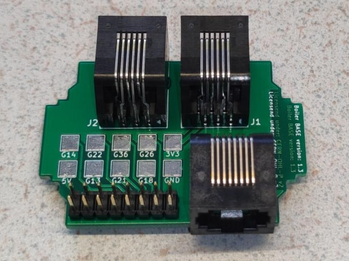
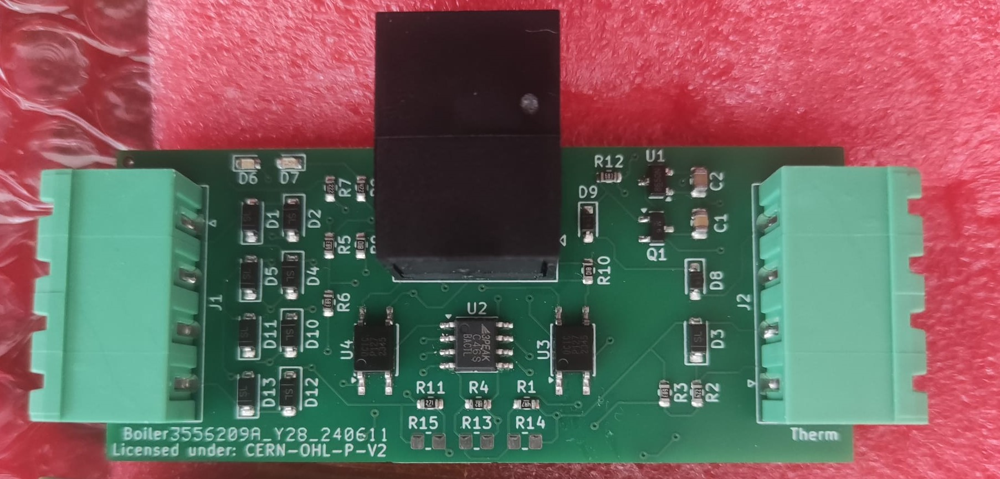
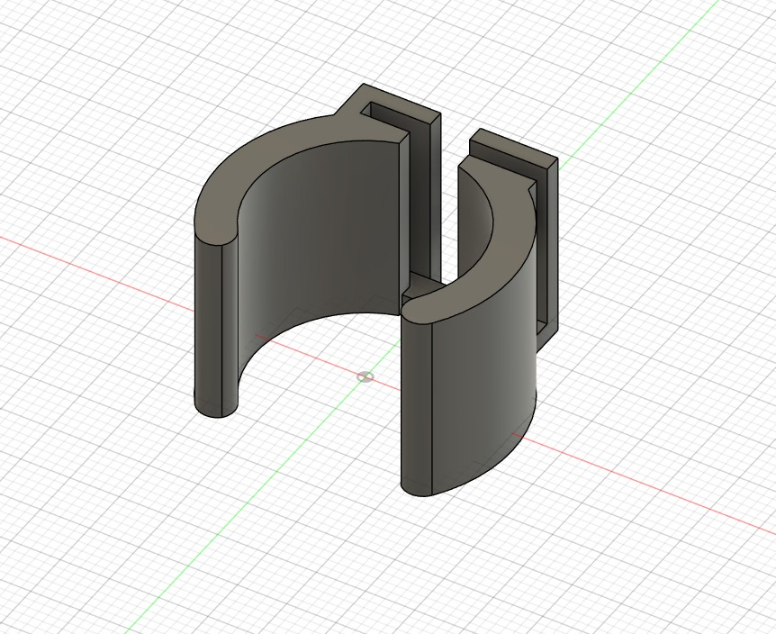

# NeedForHeat Boiler Monitor hardware <!-- omit in toc -->

This repository contains the open hardware design files for the NeedForHeat Boiler Monitor hardware, which consists of PCB and 3D printable pipeclamps for:

* Boiler-BASE module for the on the back of an [M5Stack CoreInk](https://docs.m5stack.com/en/core/coreink) device;
* Thermostat Cable Splitter module, which is inserted by the subject in the signal path between boiler and thermostat;
* Two pipe clamps with temperature sensors that can be clipped on the supply and return pipes that carry hot water from the boiler to the radiators and returning from the radiators.

This integrated device can:
* monitor OpenTherm signals between boiler and thermostat, similar to the [Twomes OpenTherm monitor](https://github.com/energietransitie/twomes-opentherm-monitor-hardware);
* monitor on/off signals between boiler and thermostat that do not adhere to the OpenTherm standard;
* monitor with supply and return water temperatures, similar to the [Twomes Temperature Monitor Hardware](https://github.com/energietransitie/twomes-temp-monitor-hardware).

<!-- it would be better to have an image of the entire solution, including cables, like the assignment presentation -->

## Table of contents <!-- omit in toc -->
- [General info](#general-info)
- [Producing](#producing)
  - [Printed Circuit Board](#printed-circuit-board)
  - [Enclosures](#enclosures)
- [Deploying](#deploying)
  - [Cost](#cost)
  - [Connecting](#connecting)
  - [Disconnecting](#disconnecting)
- [Developing](#developing)
  - [Printed Circuit Board](#printed-circuit-board-1)
  - [Enclosures](#enclosures-1)
- [Features](#features)
- [Status](#status)
- [License](#license)
- [Credits](#credits)

## General info
This repository contains the open hardware designs files and production files for the NeedForHeat Boiler Monitor. It also includes a `docs` folder with recent printouts of:
* BoilerBASE: [schematics](./docs/BoilerBase-sch.pdf) and [PCB layout](./docs/BoilerBase-pcb.pdf);
* Thermostat Cable Splitter:[schematics](./docs/ThermostatCableSplitter-sch.pdf) and [PCB layout](./docs/ThermostatCableSplitter-pcb.pdf);
* Pipe Clamps: [schematics](./docs/PipeClamp-pcb.pdf) and [PCB layout](./docs/PipeClamp-pcb.pdf).

The splitter features a 4 wire pluggable screw terminal on each side in which the cables can be connected to in almost any order.

The associated firmware that you need to run on this device was not yet implemented. I will be a combination of:
* [needforheat-generic-firmware](https://github.com/energietransitie/needforheat-generic-firmware) compiled with `env:M5STACK_COREINK`
* [twomes-opentherm-monitor-firmware](https://github.com/energietransitie/twomes-opentherm-monitor-firmware) 
* [twomes-boiler-base-firmware](https://github.com/energietransitie/twomes-boiler-base-firmware).

## Producing

### Printed Circuit Board
To manufacture the printed circuit board you can use various PCB services. 

The folder [pcb production](./pcb) includes all exported files needed to have the PCBs manufactured by [JLCPCB](https://www.jlcpcb.com). Upload a [zipped gerber file](./pcb/Gerber) to the [JLCPCB quote page](https://cart.jlcpcb.com/quote), select the amount of PCBs and a colour for the silkscreen. All other options can be left on default.

If you do not want to solder components on the PCB yourself, select `PCB assembly` and JLCPCB will do it for you (even for through-hole components if you so desire). This will take you to a page where the BOM and POS file can be uploaded. Use the files in [BOM-CPL](./pcb/BOM-CPL). 

JLCPCB provides detailed steps on their website to select component assembly, including wave soldering. For wave soldering or through-hole component assembly, specify this requirement when uploading your BOM and POS files. 

In the table below, you will find the files per PCB.

| PCB                       | zipped gerber                                                                                               | BOM                                                                                                                           | CPL                                                                                                   | Components that do not need to be placed |
| ------------------------- | ----------------------------------------------------------------------------------------------------------- | ----------------------------------------------------------------------------------------------------------------------------- | ----------------------------------------------------------------------------------------------------- | ---------------------------------------- |
| BoilerBASE                | [GERBER-BoilerBASE.zip](pcb\BoilerBASE\jlcpcb\GERBER-BoilerBASE.zip)                                        | [BOM-BoilerBASE.csv](pcb\BoilerBASE\jlcpcb\BoilerBASE\BOM-BoilerBASE.csv)                                                     | [BOM-BoilerBASE.csv](pcb\BoilerBASE\jlcpcb\BoilerBASE\CPL-BoilerBASE.csv)                             |                                          |
| Thermostat Cable Splitter | [GERBER-ThermostatCableSplitter.zip](pcb\ThermostatCableSplitter\jlcpcb\GERBER-ThermostatCableSplitter.zip) | [BOM-ThermostatCableSplitter.csv](pcb\ThermostatCableSplitter\jlcpcb\ThermostatCableSplitter\BOM-ThermostatCableSplitter.csv) | [CPL-ThermostatCableSplitter.csv](pcb\jlcpcb\ThermostatCableSplitter\CPL-ThermostatCableSplitter.csv) | `R13`, `R14`, `R15`                      |
| Pipe Clamps               | [GERBER-PipeClamp.zip](pcb\PipeClamp\jlcpcb\GERBER-PipeClamp.zip)                                           | [BOM-PipeClamp.csv](pcb\PipeClamp\jlcpcb\Splitter\BOM-PipeClamp.csv)                                                          | [CPL-PipeClamp.csv](pcb\jlcpcb\Splitter\CPL-PipeClamp.csv)                                            |                                          |

### Enclosures

To manufacure the pipe clamps you can use your own 3D printer or use a 3D printing service. 

The folder [enclosure](./enclosure) contains exported STL files for:
* [Boiler-BASE enclosure](./enclosure/BoilerBASE/fabrication/BoilerBase.STL);
* [Pipe Clamp enclosure](./enclosure/PipeClamp/fabrication/PipeClamp.stl) and [Pipe Clamp enclosure locks](./enclosure/PipeClamp/fabrication/PipeClamp_lock.stl). 
 
The STL files can be imported into any slicer and turned into G-Code for a 3D printer.

We do not yet have designs for the Thermostata Cable Splitter.

## Deploying

### Cost
To deploy the NeedForHeat Boiler Module to a home, you need all hardware listed below. Prices indicate price per Boiler Monitor, based on ordering enough hardware for 10 Boiler Monitors, June 2024 including 21% VAT and shipping to an address in the Netherlands.

| #   | Item                                                                                                                                                 | Supplier      | Price per Unit |   Subtotal |   Shipping |       Total |
| --- | ---------------------------------------------------------------------------------------------------------------------------------------------------- | ------------- | -------------: | ---------: | ---------: | ----------: |
| 1   | BoilerBASE PCB                                                                                                                                       |               |          €2.38 |      €2.38 |      €2.38 |       €4,79 |
| 1   | BoilerBASE Enclosure                                                                                                                                 | JLCPCB        |          €1.23 |      €1.23 |      €2.38 |       €3.60 |
| 1   | Thermostat Cable Splitter PCB[^1]                                                                                                                    | JLCPCB        |          €5.02 |      €5.02 |      €3.23 |       €8.25 |
| 1   | Thermostat Cable Splitter enclosure                                                                                                                  |               |          €2.38 |      €2.38 |      €2.38 |       €4,79 |
| 2   | [Pluggable Terminal Blocks (5.08 mm. 4 ways)](https://nl.farnell.com/camdenboss/ctb9209-4/terminal-block-pluggable-4pos/dp/2493644)                  |               |          €1.15 |      €2.30 |      €1.82 |       €3.12 |
| 2   | Pipe Clamp PCB                                                                                                                                       | JLCPCB        |          €3.41 |      €6.81 |      €2.30 |       €9.11 |
| 1   | Pipe Clamp enclosure                                                                                                                                 | JLCPCB        |          €1.00 |      €2.00 |      €2.38 |       €4.38 |
| 4   | [LEGO pen with friction](https://www.blokjeskoning.nl/product/pen-stroef-pen-stroef-zwart/)                                                          | Blokjeskoning |          €0.03 |      €0.12 |      €0.30 |       €0.42 |
| 1   | [M5Stack CoreInk](https://www.tinytronics.nl/nl/platformen-en-systemen/m5stack/e-paper/m5stack-m5core-ink-met-1.54-inch-e-paper-e-ink-display-esp32) | TinyTronics   |         €43.00 |     €43.00 |      €0.00 |      €43.00 |
| 2   | [RJ12 cable (male-male; 6P6C; straight; 1 m)](https://www.allekabels.nl/rj12-kabel/7400/1181351/telefoonkabel-rj12.html)                             | AlleKabels    |          €3.08 |      €6.16 |      €0.13 |       €6.29 |
| 1   | [RJ45 cable (male-male; 8P8C; straight; 1 m)](https://www.allekabels.nl/cat5e-kabel/15545/1098185/uutp-kabel-cat-5e.html)                            | AlleKabels    |          €1.29 |      €1.29 |      €0.13 |       €1.42 |
| 1   | [USB-A 230V charger + USB-A to USB-C cable](https://www.allekabels.nl/usb-oplader/4508/3636716/usb-a-oplader-usb-c-kabel.html)                       | AlleKabels    |         €14.95 |     €14.95 |      €0.13 |      €15.08 |
|     | **TOTAL**                                                                                                                                            |               |                | **€87.64** | **€17.46** | **€107.65** |

[^1]: Only the Thermostat Cable Splitter remains at the home of the user; the rest can be sent back after the measurement period.

### Connecting

Assuming that the PCBs are fully assembled, the devices have an enclosure, and the device has been programmed with the [needforheat-p1-reader-firmware](https://github.com/energietransitie/needforheat-p1-reader-firmware), you can proceed and connect the device as follows:

Tools needed;
- Screwdriver (flat head, 3 mm)
- Wire cutter
- Wire stripper

Steps:
1. **Unplug the power**
   - Unplug the boiler and thermostat from power outlets.

2. **Connect the Boiler Monitor**
   1. Cut the signal cable between the boiler and thermostat within 1.5 meters of a power outlet.
   2. Strip 2 cm of the outer sheath and 0.5 cm of insulation from each wire.
   3. Insert wires into the green pluggable screw terminal connectors and tighten screws.
   4. Attach connectors to the Thermostat Cable Splitter (boiler side: connector `J2` on the PCB and `CV` on the enclosure, thermostat side: connector `J1` on the PCB and  `T` on the enclosure).
   5. Connect the BoilerBASE to the M5Stack CoreInk MI-BUS using the 2x8 male pin header.
   6. Use an ethernet cable (RJ45) to connect the Thermostat Cable Splitter (connector `J3` on the PCB) to the BoilerBASE (connector `J3` on the PCB).
   7. Power the M5Coreink+BoilerBASE via USB-C.
   8. Insert PipeClamp PCBs into enclosures and secure with locking pins.
   9. Use cables (RJ12) to connect the BoilerBASE (connector `J1` and `J2` on the PCB; order does not matter) to the PipeClamps (connector `J1` on the PCB).
   10. Attach the M5Coreink+BoilerBASE to the boiler with its magnetic back on a flat metal surface of the boiler.
   11. Check LEDs on the Thermostat Cable Splitter; if not blinking, switch wires 1 & 2 or 3 & 4 in the pluggable screw connector on the thermostat side.

3. **Plug the power back in**
   - Reconnect the boiler and thermostat to power outlets.

### Disconnecting

After the measurement period, the user only needs to unplug the RJ45 cable from the Thermostat Cable Splitter, which can remain connected with the thermostat cable in the user's home. The rest can be sent back and re-used in other homes. 

## Developing

### Printed Circuit Board

To change the hardware design of the PCBs, you need:
* [KiCad version 8.0.0 or later](https://www.kicad.org/download/) installed to change te PCB design. 

The KiCad source files of the PCB can be found in subfolders of the folder [pcb](./pcb):
* [BoilerBASE](./pcb/BoilerBASE/)
* [ThermostatCableSplitter](./pcb/ThermostatCableSplitter/)
* [PipeClamp](./pcb/PipeClamp/)

To convert the PCBs into a format suitable for fabrication, consult the webpage of your PCB manufacturer of choice. For example, see the [JLCPCB guide on how to export Gerbers](https://support.jlcpcb.com/article/149-how-to-generate-gerber-and-drill-files-in-kicad) and the  [JLCPCB guide how to export the BOM and POS files](https://support.jlcpcb.com/article/84-how-to-generate-the-bom-and-centroid-file-from-kicad). You may also use a KiCad plug-in for this purpose such as [kicad-jlcpcb-tools](https://github.com/Bouni/kicad-jlcpcb-tools).

### Enclosures
To change the hardware design of an enclosure, you need either:
* [Autodesk Fusion 360]([https://www.kicad.org/download/](https://www.autodesk.com/products/fusion-360/personal)) installed (Autodesk provides 30 day free trials and [free one-year educational access](https://www.autodesk.com/education/edu-software/overview?sorting=featured&filters=individual) to its products and services for eligible students, teachers and research staff); 
* or [FreeCAD](https://www.freecadweb.org/), an open source alternative.

The source files of the enclosures can be found in subfolders of the folder [enclosure](./enclosure):
* [BoilerBASE](./enclosure/BoilerBASE)
* ThermostatCableSplitter (*We do not yet have a design for this enclosure*)
* [PipeClamp](./enclosure/PipeClamp/)

## Features
The  NeedForHeat Boiler Monitor features the follwoing main hardware components:
- [x] Thermostat Cable Splitter PCB with 4-wire pluggable screw terminals and circuit to monitor OpenTherm communication, including LEDs and optocouplers;
- [x] Circuit in the Thermostat Cable Splitter that allows (mostly) order agnostic connection of the 4 wires per pluggable screw connector (see also [connecting the devices](#connecting-the-devices));
- [x] Pipe Clamp PCB to measure temperatures from the supply and return pipes below the boiler.
- [x] Pipe Clamp enclosures, which can be 3D printed as a clamp that presses the temperature sensors agains a water pipe below a heating boiler and provide a  locking mechanism the prevent the PCB from falling out.

To-do:
- Thermostat Cable Splitter
  - [ ] Reconsider the choice of pluggable screw connectors: reversible? lever-operated (e.g., [WAGO PCB terminal block](https://www.wago.com/global/c/pcb-terminal-blocks-and-pluggable-connectors?f=%3Afacet_product_Produkttyp_7845%3APCB%20terminal%20blocks%3Afacet_product_Leiterplattenklemmentyp_10295%3APCB%20terminal%20blocks%3Afacet_product_Polzahl_6%3A4%3Afacet_product_Betaetigungsart_01_3901%3ALever&sort=relevance&page=1&pageSize=50))?
  - [ ] Redesign the thermostat side such that the user can mount the wires truly in any order.
  - [ ] Design an enclosure.
* BoilerBASE
  - [ ] Add an 868 MHz SMD transceiver chip to enable monitoring of wireless thermostats.
  - [ ] Add connectors to BOM and CPL files and repair rotation errors to enable through-hole soldering by JLCPC.
  - [ ] Evaluate relocating the 2x8 pin header from the bottom side to the top side of the PCB to reduce JLCPCB manufacturing costs. 
  - [ ] Improve BOM and CPL for JLCPCB through hole assembly. 
  - [ ] Design an enclosure that adds multiple mounting options
    - [ ] room to embed permanent magnets to make it stick to flat metallic surfaces of boilers;
    - [ ] a tie wrap hole.
* Pipe Clamps
  - [ ] Redesign 3D printed enclosures to ensure strength and durability.

## Status
Project is:  _in_progress_

## License
The hardware designs in this repository are available under the [CERN-OHL-P v2 license](./LICENSE), Copyright 2024 [Research group Energy Transition, Windesheim University of Applied Sciences](https://windesheim.nl/energietransitie)

## Credits
This hardware is a collaborative effort of:
* Bram Busch · [@BlueRisen](https://github.com/BlueRisen)
* Daan Tellegen · [@D-Tellegen](https://github.com/D-Tellegen)

Earlier versions of this open hardware were designed by:
* Huub Buter · [@h-buter](https://github.com/h-buter>)
* Mirjam van Wee
* Kees Fokker
  
Product owners:
* Henri ter Hofte · [@henriterhofte](https://github.com/henriterhofte)
* Marco Winkelman · [@MarcoW71](https://github.com/MarcoW71)

We use and gratefully acknowlegde the efforts of the makers of the following designs:

* [Twomes OpenTherm monitor](https://github.com/energietransitie/twomes-opentherm-monitor-hardware), by Research group Energy Transition at Windesheim University of Applied Sciences, licenced under [Apache 2.0](https://raw.githubusercontent.com/energietransitie/twomes-opentherm-monitor-hardware/main/LICENSE)
* [Twomes Temperature Monitor Hardware](https://github.com/energietransitie/twomes-temp-monitor-hardware), by Research group Energy Transition at Windesheim University of Applied Sciences, licenced under [Apache 2.0](https://raw.githubusercontent.com/energietransitie/twomes-temp-monitor-hardware/main/LICENSE)
* [KiCad Libraries](https://kicad.github.io/), by the KiCad Development Team, licensed under [an adapted version of the CC-BY-SA 4.0 License](https://www.kicad.org/libraries/license/)
